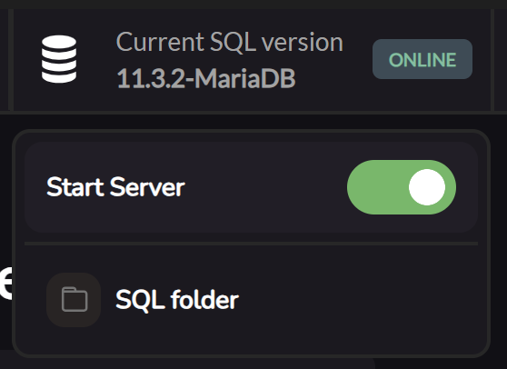

    
    <h1 style="margin-bottom: 0">ZAMP</h1>

    
Zero Configuration Apache MySQL PHP

⚠️ *THE APP IS STILL UNDER DEVELOPMENT*

## Overview

**ZAMP** is an all-in-one development stack for web developers that simplifies the setup of Apache, MySQL, and PHP. With **zero configuration required**, ZAMP allows you to focus on developing your application without worrying about server setup and maintenance.

## Features

- **Zero Configuration**: Just install and run. No need to spend hours configuring your environment.
- **Integrated Management**: Easily manage Apache, MySQL, and PHP services from a single interface.
- **Extension Management**: Enable or disable PHP extensions with a simple checkbox interface.
- **Version Control**: Download and switch between different PHP versions with ease.
- **MySQL / MariaDB Launcher**: Simply click to open and close your SQL instance.
- **Drag and Drop Project Setup**: Simply drag and drop your project folders into ZAMP to get started.

## Installation

Currently, ZAMP is only available for Windows. We are actively working on making ZAMP available for macOS and Linux in the near future. Stay tuned for updates!

### Windows

1. Download the latest [ZAMP for Windows](https://github.com/Axthauvin/ZAMP/releases/tag/Windows).
2. Extract the archive to your preferred location.
3. Run `zamp.Setup.1.0.0.exe`.

## Usage

Once installed, you can access the following services:

- **Apache**: Clicking the start button 

- **PHPMyAdmin**: PHP will automatically configure itself within the app. 
You can still change the version or the extensions using the dedicated areas.

- **My SQL / Maria DB** : ZAMP uses MariaDB to run the SQL as it has binaries. MariaDB is retro compatible with MySQL, so you can still use workbench to access your server.

You can access the SQL server in the dedicated area

## Help Improve `ZAMP` 🐟🐠

### How to Install for Local Testing

1. Run `npm install` to install all the dependencies (you need to install [Node.js & NPM](https://docs.npmjs.com/downloading-and-installing-node-js-and-npm)).
2. Run `npm start` to start the app (The app is currently only made for Windows).

### How to Contribute

We would love to have you as part of this project! There are many ways to contribute, and we warmly welcome all kinds of involvement:

- **Feedback, Ideas, and Suggestions**: If we can make ZAMP more useful, we'd love to hear your ideas!
- **Issue Reporting**: If something didn’t work, felt harder than it should, or if you figured out a trick, please file an [issue](https://github.com/Axthauvin/ZAMP/issues) or contribute to the documentation.
- **Code Contributions**: We welcome code contributions! If you’re looking for an area to contribute, check out the [issues](https://github.com/Axthauvin/ZAMP/issues) or contact us directly. We support contributors of all skill levels.

Please let us know if you'd like to join in but are unsure how. We’d be thrilled to help you find something that suits your interests and resources.

## License

All parts of this project are openly available under the terms of the [MIT License](https://github.com/Axthauvin/ZAMP/blob/main/LICENSE).

## Screenshots

---

Made with ❤️ by the ZAMP team.
